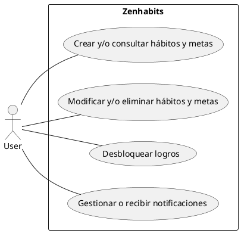
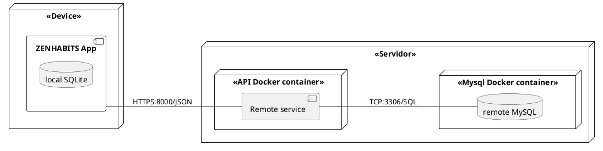
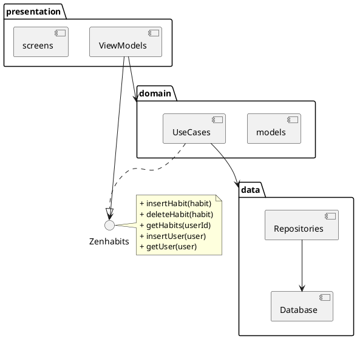
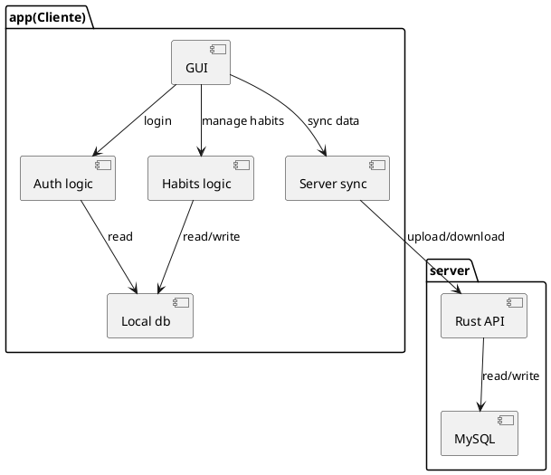
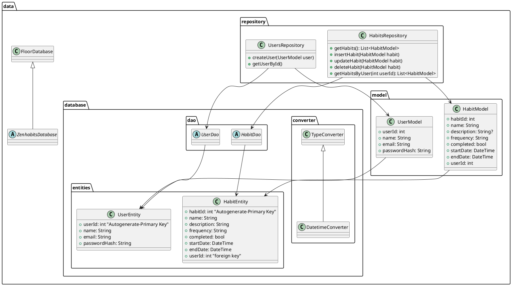
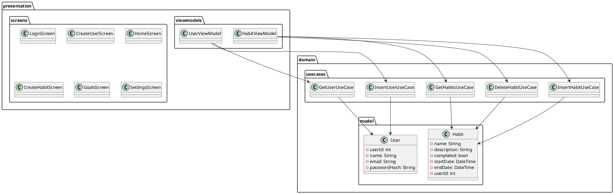
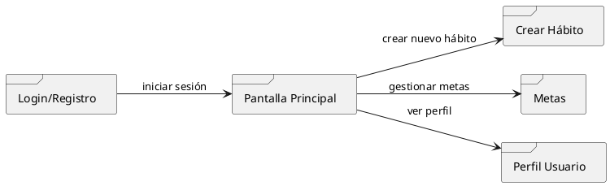

###### ALBA ALMORIL BENITO.
# ZENHABITS
> **NOTA**
> Todos los diagramas se encuentran en `docs/img`

## Requisitos
* **Funcionales:**
  - Crear, consultar, modificar y eliminar hábitos y metas.
  - Gestionar y recibir notificaciones.
  - Desbloquear logros.
* **No funcionales:**
  - Compatibilidad Android/iOS.
  - Funcionamiento offline con SQLite.
  - Interfaz intuitiva y minimalista.
  - Seguridad en la API con autenticación JWT.
  - Pruebas de usabilidad.
  - Personalizar personaje.
 

## Diagrama de casos de uso

 

## Diagrama de despliegue

La API RESTful desarrollada en Rust utiliza el crate sqlx como gestor de conexiones y ORM asíncrono para comunicarse con la base de datos MySQL alojada en un contenedor Docker. La comunicación se realiza a través de TCP sobre el puerto expuesto por Docker (3306), utilizando el protocolo SQL.
Por su parte, la app móvil establece la conexión con la API mediante HTTPS (puerto 8000), usando JSON (JavaScript Object Notation) como formato de datos.

 

## Diagrama de componentes (ongoing)

 

## Diagrama de clases (ongoing)

 

## Diagrama de navegación

> **INFO**
> Versión más detallada en `docs/img`

## Modelo entidad-relación (ERD)
Hecho en ERDPlus: https://erdplus.com/
> (ubicado en `docs/img/MER.png`)