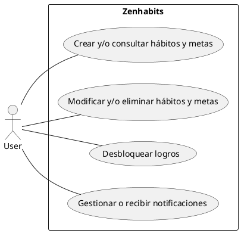
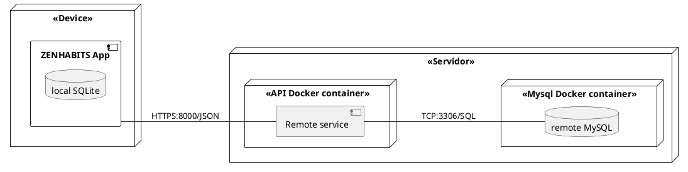
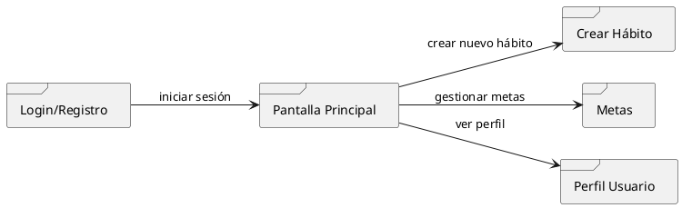

###### ALBA ALMORIL BENITO.
# ZENHABITS
> **NOTE**
> All diagrams can be found in ``docs/img``

## 1. CONTEXT
In today’s fast-paced society, maintaining healthy habits and staying productive can be difficult. According to Duhigg (2012), forming long-term habits requires consistency, repetition, and sustained motivation. However, many people struggle to maintain discipline or forget their goals over time. Existing tools like Todoist, Trello, or Habitica help to some extent, but often rely on constant internet access, offer unintuitive interfaces, or fail to keep users engaged.

_ZENHABITS_ is a cross-platform application designed to help users develop and sustain personal habits and goals through an engaging gamified experience. Inspired by Habitica, the app rewards users for completing habits with achievements and in-game progress, such as coins or character upgrades. The user's avatar reflects their real-world performance—gaining energy or experience for progress, and losing health when neglecting goals. The aim is to make habit formation both fun and sustainable.

This project also serves as a personal and academic challenge, allowing me to improve my skills in mobile and backend development using Flutter and Rust.

 

## 2. ANALYSIS
_ZENHABITS_ provides a clean, intuitive interface and supports hybrid data storage (local + cloud sync). To ensure the app meets user needs, a detailed requirement analysis was performed.

### Requirements
#### Functional Requirements
* Create, edit, view, and delete habits and goals.
* Manage notifications to remind users about habits and goals.
* Unlock achievements based on habit/goal completion.
#### Non-Functional Requirements
* Usability
  * User-friendly, clean, and intuitive interface.
  * Minimalist visual design with clear icons and smooth navigation.
  * Built-in help or guide available for new users
  * Portability and reliability
  * Available on multiple platforms (mobile and desktop).
  * Responsive design for various screen sizes.
  * Offline access to core functionality.
  * Prevent data loss during active sessions.
  * Security and efficiency.
  * Secure handling of personal data and user credentials.
  * Access restricted via secure authentication mechanisms.
  * Fast and responsive even on low-resource devices.

### Use Cases
The primary actor is the user, who interacts with the app to manage habits and goals, receive notifications, and unlock achievements. Achievements are granted after consistently completing tasks, motivating the user to stay on track.

 

## DESIGN
### Architectural Model
ZENHABITS is designed to be a cross-platform, scalable, and secure solution. The application targets mobile platforms (Android and iOS), desktop environments (Windows, macOS, Linux), and aims for future web deployment.

The system follows a client-server architecture, where the mobile app communicates with a remote backend through a RESTful API. Both the frontend and backend adhere to the principles of Clean Architecture, which promotes a clear separation of concerns across three main layers: data, domain, and presentation. This modular structure facilitates long-term maintainability and easier feature expansion.

In the presentation layer of the mobile app, the MVVM (Model-View-ViewModel) pattern is used to manage state and interactions with the domain layer, improving testability and code organization.

The backend and its database are fully containerized using Docker, providing a modular, isolated, and scalable development and deployment environment.

The app also implements responsive design principles to ensure a consistent and user-friendly experience across a variety of screen sizes and devices, including smartphones, tablets, and desktops.

These architectural decisions contribute to a robust and maintainable system capable of evolving with minimal refactoring costs.

### Technology Stack
#### Client – Flutter + Dart
The mobile application is built with Flutter and Dart, enabling compatibility with Android, iOS, desktop platforms (Windows, macOS, Linux), and in the future, the web. It handles:
* UI rendering
* Presentation logic
* Local storage via SQLite
* Secure HTTP communication for API synchronization and user authentication

#### Backend API – Rust + Axum
The backend is implemented in Rust using the Axum framework to provide fast, safe, and reliable HTTP endpoints. It includes:
* REST services
* Authentication mechanisms
* Business logic processing
#### Database – MySQL + SQLx
A MySQL database stores all persistent user data, habits, goals, achievements, and settings. It ensures:
* Data integrity
* Asynchronous access via SQLx
* Secure persistence and querying

#### Remote Services – Docker
Both the backend and database services are dockerized, each in its own container, which allows for:
* Modular deployment
* Environment isolation
* Easier scalability and CI/CD integration

The REST API developed in Rust uses the sqlx crate as an asynchronous connection manager and ORM to interact with the MySQL database hosted in a Docker container. Communication takes place over TCP through the port exposed by Docker (3306), using the SQL protocol.
Meanwhile, the mobile app connects to the API via HTTPS (port 8000), using JSON (JavaScript Object Notation) as the data exchange format.

 

## Diagrama de clases (ongoing)

 

## Diagrama de navegación

> **INFO**
> Versión más detallada en `docs/img`

## Modelo entidad-relación (ERD)
Hecho en ERDPlus: https://erdplus.com/
> (ubicado en `docs/img/MER.png`)